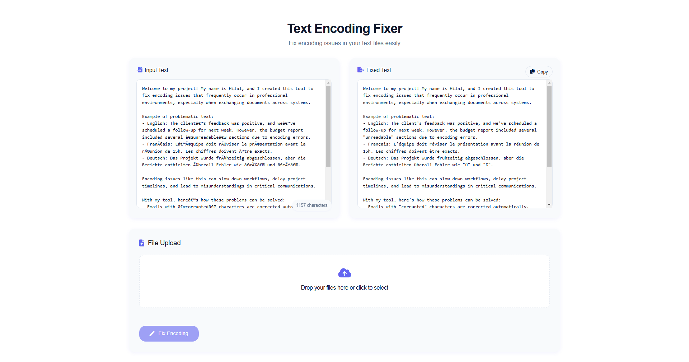
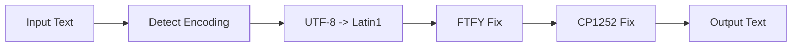

# Text Encoding Fixer 🔧

<div align="center">
  
  <p>A powerful web application to fix encoding issues in text and CSV files</p>
</div>

<div align="center">
  
  
  
</div>

---

## 🌟 Features

- ⚡ **Real-time Text Fixing**: Instant encoding correction as you type
- 📊 **CSV Support**: Process CSV files while preserving structure
- 🔍 **Smart Detection**: Auto-detects various encoding types
- 📦 **Batch Processing**: Handle multiple files at once
- 🎨 **Modern UI**: Clean interface with drag-and-drop
- ⬇️ **Auto Download**: Fixed files download automatically
- 📈 **Progress Tracking**: Visual feedback during processing

## 📦 Dependencies

| Package | Version | Purpose |
|---------|---------|---------|
| Flask | 2.3.3 | Web Framework |
| pandas | ≥2.0.0 | Data Processing |
| ftfy | 6.1.1 | Text Encoding Fixes |
| chardet | 5.2.0 | Encoding Detection |
| Werkzeug | 2.3.7 | WSGI Utilities |
| codecs | Built-in | Encoding/Decoding |
| BytesIO | Built-in | Binary I/O |
| base64 | Built-in | Base64 Encoding |
| datetime | Built-in | Timestamp Generation |
| csv | Built-in | CSV File Handling |
| os | Built-in | File Operations |
| sys | Built-in | System Settings |

## 🛠️ Installation

1. **Clone the repository**
```bash
git clone https://github.com/yourusername/text-encoding-fixer.git
cd text-encoding-fixer
```

2. **Create a virtual environment**
```bash
python -m venv venv
source venv/bin/activate  # On Windows: venv\Scripts\activate
```

3. **Install dependencies**
```bash
pip install -r requirements.txt
```

## 🚀 Quick Start

1. **Start the server**
```bash
python app.py
```

2. **Open your browser**
- Go to `http://localhost:5000`
- You'll see the main interface ready to use

3. **Choose your method**
- 📝 **Text Mode**: Paste text directly
- 📁 **File Mode**: Drop CSV files or click to upload

## 🔧 How It Works

### Text Processing Pipeline



### Core Algorithm

```python
def fix_text_encoding(text):
    # Method 1: UTF-8 -> Latin1 -> UTF-8
    try:
        fixed = text.encode('latin1').decode('utf-8')
        if fixed != text: return fixed
    except: pass

    # Method 2: FTFY Library
    try:
        fixed = ftfy.fix_text(text)
        if fixed != text: return fixed
    except: pass

    # Method 3: CP1252 -> UTF-8
    try:
        fixed = text.encode('cp1252').decode('utf-8')
        if fixed != text: return fixed
    except: pass

    return text
